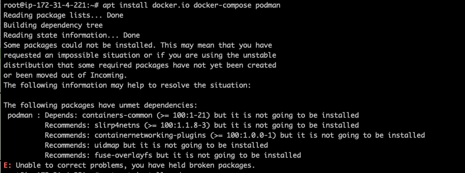
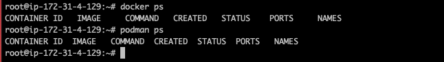
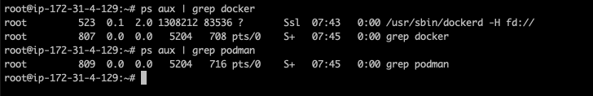
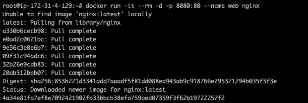
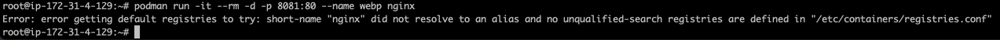
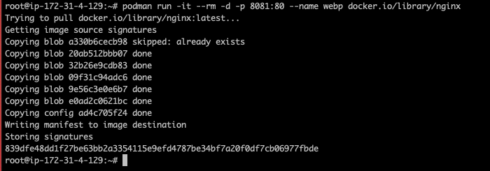
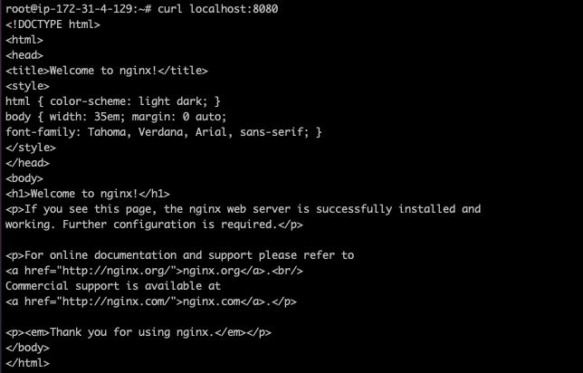
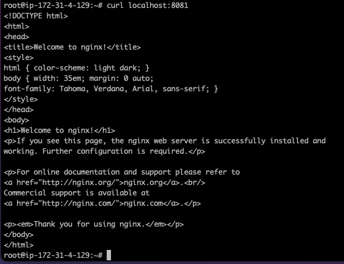

# Docker playground

## Instance prep (ubuntu/images/hvm-ssd/ubuntu-focal-20.04-amd64-server-20210430)

Podman is not available in the Ubuntu 20.04 official repository, we have to use the Kubic repository

```bash
source /etc/os-release
echo "deb https://download.opensuse.org/repositories/devel:/kubic:/libcontainers:/stable/xUbuntu_${VERSION_ID}/ /" | sudo tee /etc/apt/sources.list.d/devel:kubic:libcontainers:stable.list
curl -L "https://download.opensuse.org/repositories/devel:/kubic:/libcontainers:/stable/xUbuntu_${VERSION_ID}/Release.key" | sudo apt-key add -
```

Let's install docker, docker-compose and Podman

```bash
apt update
apt upgrade
apt install docker.io docker-compose podman
```

Got back an error

```bash
root@ip-172-31-4-221:~# apt install docker.io docker-compose podman
Reading package lists... Done
Building dependency tree
Reading state information... Done
Some packages could not be installed. This may mean that you have
requested an impossible situation or if you are using the unstable
distribution that some required packages have not yet been created
or been moved out of Incoming.
The following information may help to resolve the situation:

The following packages have unmet dependencies:
 podman : Depends: containers-common (>= 100:1-21) but it is not going to be installed
          Recommends: slirp4netns (>= 100:1.1.8-3) but it is not going to be installed
          Recommends: containernetworking-plugins (>= 100:1.0.0-1) but it is not going to be installed
          Recommends: uidmap but it is not going to be installed
          Recommends: fuse-overlayfs but it is not going to be installed
E: Unable to correct problems, you have held broken packages.
```



## Instance prep (debian-11-amd64-20210814-734-a264997c-d509-4a51-8e85-c2644a3f8ba2)

```bash
apt update
apt upgrade
apt install docker.io docker-compose podman
```

Let's run the binaries

```bash
root@ip-172-31-4-129:~# docker ps
CONTAINER ID   IMAGE     COMMAND   CREATED   STATUS    PORTS     NAMES
root@ip-172-31-4-129:~# podman ps
CONTAINER ID  IMAGE   COMMAND  CREATED  STATUS  PORTS   NAMES
root@ip-172-31-4-129:~#
```



## What is running in background

`Docker`: daemon running in background

`Podman`: nothing running in background

```bash
root@ip-172-31-4-129:~# ps aux | grep docker
root         523  0.1  2.0 1308212 83536 ?       Ssl  07:43   0:00 /usr/sbin/dockerd -H fd://
root         807  0.0  0.0   5204   708 pts/0    S+   07:45   0:00 grep docker
root@ip-172-31-4-129:~# ps aux | grep podman
root         809  0.0  0.0   5204   716 pts/0    S+   07:45   0:00 grep podman
root@ip-172-31-4-129:~#

```



## Spinning up a container (Nginx)

### Docker

```bash
root@ip-172-31-4-129:~# docker run -it --rm -d -p 8080:80 --name web nginx
Unable to find image 'nginx:latest' locally
latest: Pulling from library/nginx
a330b6cecb98: Pull complete
e0ad2c0621bc: Pull complete
9e56c3e0e6b7: Pull complete
09f31c94adc6: Pull complete
32b26e9cdb83: Pull complete
20ab512bbb07: Pull complete
Digest: sha256:853b221d3341add7aaadf5f81dd088ea943ab9c918766e295321294b035f3f3e
Status: Downloaded newer image for nginx:latest
4a34e81fa7ef8e7092421902fb33bbcb38efa759aed07359f3f62b19722257f2
root@ip-172-31-4-129:~#
```



### Podman

```root@ip-172-31-4-129:~# podman run -it --rm -d -p 8080:81 --name webp nginx
Error: error getting default registries to try: short-name "nginx" did not resolve to an alias and no unqualified-search registries are defined in "/etc/containers/registries.conf"
root@ip-172-31-4-129:~# podman run -it --rm -d -p 8081:80 --name webp nginx
```



```bash
root@ip-172-31-4-129:~# podman run -it --rm -d -p 8081:80 --name webp docker.io/library/nginx
Trying to pull docker.io/library/nginx:latest...
Getting image source signatures
Copying blob a330b6cecb98 skipped: already exists
Copying blob 20ab512bbb07 done
Copying blob 32b26e9cdb83 done
Copying blob 09f31c94adc6 done
Copying blob 9e56c3e0e6b7 done
Copying blob e0ad2c0621bc done
Copying config ad4c705f24 done
Writing manifest to image destination
Storing signatures
839dfe48dd1f27be63bb2a3354115e9efd4787be34bf7a20f0df7cb06977fbde
root@ip-172-31-4-129:~#
```



## Check what is running

```bash
root@ip-172-31-4-129:~# docker container ls
CONTAINER ID   IMAGE     COMMAND                  CREATED          STATUS          PORTS                  NAMES
4a34e81fa7ef   nginx     "/docker-entrypoint.…"   2 minutes ago    Up 2 minutes    0.0.0.0:8080->80/tcp   web
root@ip-172-31-4-129:~# podman container ls
CONTAINER ID  IMAGE                           COMMAND               CREATED             STATUS                 PORTS                 NAMES
839dfe48dd1f  docker.io/library/nginx:latest  nginx -g daemon o...  About a minute ago  Up About a minute ago  0.0.0.0:8081->80/tcp  webp
root@ip-172-31-4-129:~#
```

```bash
root@ip-172-31-4-129:~# netstat -anopl
Active Internet connections (servers and established)
Proto Recv-Q Send-Q Local Address           Foreign Address         State       PID/Program name     Timer
tcp        0      0 0.0.0.0:22              0.0.0.0:*               LISTEN      550/sshd: /usr/sbin  off (0.00/0/0)
tcp        0      0 127.0.0.1:38403         0.0.0.0:*               LISTEN      530/containerd       off (0.00/0/0)
tcp        0      0 0.0.0.0:8080            0.0.0.0:*               LISTEN      885/docker-proxy     off (0.00/0/0)
tcp        0      0 0.0.0.0:8081            0.0.0.0:*               LISTEN      2827/conmon          off (0.00/0/0)
tcp        0    256 172.31.4.129:22         90.214.233.109:64176    ESTABLISHED 760/sshd: admin [pr  on (0.04/0/0)
tcp6       0      0 :::22                   :::*                    LISTEN      550/sshd: /usr/sbin  off (0.00/0/0)
udp        0      0 127.0.0.1:323           0.0.0.0:*                           549/chronyd          off (0.00/0/0)
udp        0      0 0.0.0.0:68              0.0.0.0:*                           384/dhclient         off (0.00/0/0)
udp6       0      0 ::1:323                 :::*                                549/chronyd          off (0.00/0/0)
udp6       0      0 fe80::f2:eff:fef4:9:546 :::*                                439/dhclient         off (0.00/0/0)
```

### Docker

```bash
root@ip-172-31-4-129:~# ps aux
[...]
root         885  0.0  0.3 1148488 15016 ?       Sl   07:47   0:00 /usr/sbin/docker-proxy -proto tcp -host-ip 0.0.0.0 -host-port 8080 -container-ip 172.17.0.2 -container-port 80
root         898  0.0  0.5 1452000 23868 ?       Sl   07:47   0:00 /usr/bin/containerd-shim-runc-v2 -namespace moby -id 4a34e81fa7ef8e7092421902fb33bbcb38efa759aed07359f3f62b19722257f2 -address /run/contain
root         917  0.0  0.1  10664  6176 pts/0    Ss+  07:47   0:00 nginx: master process nginx -g daemon off;
message+     973  0.0  0.0  11068  2704 pts/0    S+   07:47   0:00 nginx: worker process
message+     974  0.0  0.0  11068  2704 pts/0    S+   07:47   0:00 nginx: worker process
[...]
```

```bash
root@ip-172-31-4-129:~# curl localhost:8080
<!DOCTYPE html>
<html>
<head>
<title>Welcome to nginx!</title>
<style>
html { color-scheme: light dark; }
body { width: 35em; margin: 0 auto;
font-family: Tahoma, Verdana, Arial, sans-serif; }
</style>
</head>
<body>
<h1>Welcome to nginx!</h1>
<p>If you see this page, the nginx web server is successfully installed and
working. Further configuration is required.</p>

<p>For online documentation and support please refer to
<a href="http://nginx.org/">nginx.org</a>.<br/>
Commercial support is available at
<a href="http://nginx.com/">nginx.com</a>.</p>

<p><em>Thank you for using nginx.</em></p>
</body>
</html>
```



### Podman

```
root@ip-172-31-4-129:~# ps aux
[...]
root        2827  0.0  0.0  81276  2084 ?        Ssl  08:16   0:00 /usr/bin/conmon --api-version 1 -c 839dfe48dd1f27be63bb2a3354115e9efd4787be34bf7a20f0df7cb06977fbde -u 839dfe48dd1f27be63bb2a3354115e9efd47
root        2838  0.0  0.1  10664  6192 pts/0    Ss+  08:16   0:00 nginx: master process nginx -g daemon off;
message+    2874  0.0  0.0  11068  2524 pts/0    S+   08:16   0:00 nginx: worker process
message+    2875  0.0  0.0  11068  2524 pts/0    S+   08:16   0:00 nginx: worker process
[...]
```

```bash
root@ip-172-31-4-129:~# curl localhost:8081
<!DOCTYPE html>
<html>
<head>
<title>Welcome to nginx!</title>
<style>
html { color-scheme: light dark; }
body { width: 35em; margin: 0 auto;
font-family: Tahoma, Verdana, Arial, sans-serif; }
</style>
</head>
<body>
<h1>Welcome to nginx!</h1>
<p>If you see this page, the nginx web server is successfully installed and
working. Further configuration is required.</p>

<p>For online documentation and support please refer to
<a href="http://nginx.org/">nginx.org</a>.<br/>
Commercial support is available at
<a href="http://nginx.com/">nginx.com</a>.</p>

<p><em>Thank you for using nginx.</em></p>
</body>
</html>
root@ip-172-31-4-129:~#
```



## Let's check the headers

### Docker

```bash
root@ip-172-31-4-129:~# curl -I localhost:8080
HTTP/1.1 200 OK
Server: nginx/1.21.3
Date: Wed, 15 Sep 2021 08:21:50 GMT
Content-Type: text/html
Content-Length: 615
Last-Modified: Tue, 07 Sep 2021 15:21:03 GMT
Connection: keep-alive
ETag: "6137835f-267"
Accept-Ranges: bytes
```

### Podman

```bash
root@ip-172-31-4-129:~# curl -I localhost:8081
HTTP/1.1 200 OK
Server: nginx/1.21.3
Date: Wed, 15 Sep 2021 08:22:00 GMT
Content-Type: text/html
Content-Length: 615
Last-Modified: Tue, 07 Sep 2021 15:21:03 GMT
Connection: keep-alive
ETag: "6137835f-267"
Accept-Ranges: bytes
```

## Let's check the images

```bash
root@ip-172-31-4-129:~# docker image ls
REPOSITORY   TAG       IMAGE ID       CREATED      SIZE
nginx        latest    ad4c705f24d3   5 days ago   133MB
root@ip-172-31-4-129:~# podman image ls
REPOSITORY               TAG     IMAGE ID      CREATED     SIZE
docker.io/library/nginx  latest  ad4c705f24d3  5 days ago  138 MB
root@ip-172-31-4-129:~#
```

The two containers are using the same image id 🎉

## Let's check the logs

### Docker container

```bash
root@ip-172-31-4-129:~# docker logs 4a
/docker-entrypoint.sh: /docker-entrypoint.d/ is not empty, will attempt to perform configuration
/docker-entrypoint.sh: Looking for shell scripts in /docker-entrypoint.d/
/docker-entrypoint.sh: Launching /docker-entrypoint.d/10-listen-on-ipv6-by-default.sh
10-listen-on-ipv6-by-default.sh: info: Getting the checksum of /etc/nginx/conf.d/default.conf
10-listen-on-ipv6-by-default.sh: info: Enabled listen on IPv6 in /etc/nginx/conf.d/default.conf
/docker-entrypoint.sh: Launching /docker-entrypoint.d/20-envsubst-on-templates.sh
/docker-entrypoint.sh: Launching /docker-entrypoint.d/30-tune-worker-processes.sh
/docker-entrypoint.sh: Configuration complete; ready for start up
2021/09/15 07:47:32 [notice] 1#1: using the "epoll" event method
2021/09/15 07:47:32 [notice] 1#1: nginx/1.21.3
2021/09/15 07:47:32 [notice] 1#1: built by gcc 8.3.0 (Debian 8.3.0-6)
2021/09/15 07:47:32 [notice] 1#1: OS: Linux 5.10.0-8-cloud-amd64
2021/09/15 07:47:32 [notice] 1#1: getrlimit(RLIMIT_NOFILE): 1048576:1048576
2021/09/15 07:47:32 [notice] 1#1: start worker processes
2021/09/15 07:47:32 [notice] 1#1: start worker process 33
2021/09/15 07:47:32 [notice] 1#1: start worker process 34
172.17.0.1 - - [15/Sep/2021:08:01:54 +0000] "GET / HTTP/1.0" 200 615 "-" "Lynx/2.9.0dev.6 libwww-FM/2.14 SSL-MM/1.4.1 GNUTLS/3.7.1" "-"
172.17.0.1 - - [15/Sep/2021:08:02:13 +0000] "GET / HTTP/1.1" 200 615 "-" "curl/7.74.0" "-"
172.17.0.1 - - [15/Sep/2021:08:05:40 +0000] "HEAD / HTTP/1.1" 200 0 "-" "curl/7.74.0" "-"
172.17.0.1 - - [15/Sep/2021:08:21:40 +0000] "HEAD / HTTP/1.1" 200 0 "-" "curl/7.74.0" "-"
172.17.0.1 - - [15/Sep/2021:08:21:50 +0000] "HEAD / HTTP/1.1" 200 0 "-" "curl/7.74.0" "-"
```

### Podman container

```bash
root@ip-172-31-4-129:~# podman logs 83
/docker-entrypoint.sh: /docker-entrypoint.d/ is not empty, will attempt to perform configuration
/docker-entrypoint.sh: Looking for shell scripts in /docker-entrypoint.d/
/docker-entrypoint.sh: Launching /docker-entrypoint.d/10-listen-on-ipv6-by-default.sh
10-listen-on-ipv6-by-default.sh: info: Getting the checksum of /etc/nginx/conf.d/default.conf
10-listen-on-ipv6-by-default.sh: info: Enabled listen on IPv6 in /etc/nginx/conf.d/default.conf
/docker-entrypoint.sh: Launching /docker-entrypoint.d/20-envsubst-on-templates.sh
/docker-entrypoint.sh: Launching /docker-entrypoint.d/30-tune-worker-processes.sh
/docker-entrypoint.sh: Configuration complete; ready for start up
2021/09/15 08:16:21 [notice] 1#1: using the "epoll" event method
2021/09/15 08:16:21 [notice] 1#1: nginx/1.21.3
2021/09/15 08:16:21 [notice] 1#1: built by gcc 8.3.0 (Debian 8.3.0-6)
2021/09/15 08:16:21 [notice] 1#1: OS: Linux 5.10.0-8-cloud-amd64
2021/09/15 08:16:21 [notice] 1#1: getrlimit(RLIMIT_NOFILE): 1048576:1048576
2021/09/15 08:16:21 [notice] 1#1: start worker processes
2021/09/15 08:16:21 [notice] 1#1: start worker process 31
2021/09/15 08:16:21 [notice] 1#1: start worker process 32
172.16.16.1 - - [15/Sep/2021:08:19:50 +0000] "GET / HTTP/1.1" 200 615 "-" "curl/7.74.0" "-"
172.16.16.1 - - [15/Sep/2021:08:22:00 +0000] "HEAD / HTTP/1.1" 200 0 "-" "curl/7.74.0" "-"
```

The logs command is outputting the same output for both docker and podman

## Container inspect

### Docker

```bash
docker container inspect 4a
[
    {
        "Id": "4a34e81fa7ef8e7092421902fb33bbcb38efa759aed07359f3f62b19722257f2",
        "Created": "2021-09-15T07:47:30.05478575Z",
        "Path": "/docker-entrypoint.sh",
        "Args": [
            "nginx",
            "-g",
            "daemon off;"
        ],
        "State": {
            "Status": "running",
            "Running": true,
            "Paused": false,
            "Restarting": false,
            "OOMKilled": false,
            "Dead": false,
            "Pid": 917,
            "ExitCode": 0,
            "Error": "",
            "StartedAt": "2021-09-15T07:47:32.1273391Z",
            "FinishedAt": "0001-01-01T00:00:00Z"
        },
        "Image": "sha256:ad4c705f24d392b982b2f0747704b1c5162e45674294d5640cca7076eba2865d",
        "ResolvConfPath": "/var/lib/docker/containers/4a34e81fa7ef8e7092421902fb33bbcb38efa759aed07359f3f62b19722257f2/resolv.conf",
        "HostnamePath": "/var/lib/docker/containers/4a34e81fa7ef8e7092421902fb33bbcb38efa759aed07359f3f62b19722257f2/hostname",
        "HostsPath": "/var/lib/docker/containers/4a34e81fa7ef8e7092421902fb33bbcb38efa759aed07359f3f62b19722257f2/hosts",
        "LogPath": "/var/lib/docker/containers/4a34e81fa7ef8e7092421902fb33bbcb38efa759aed07359f3f62b19722257f2/4a34e81fa7ef8e7092421902fb33bbcb38efa759aed07359f3f62b19722257f2-json.log",
        "Name": "/web",
        "RestartCount": 0,
        "Driver": "overlay2",
        "Platform": "linux",
        "MountLabel": "",
        "ProcessLabel": "",
        "AppArmorProfile": "docker-default",
        "ExecIDs": null,
        "HostConfig": {
            "Binds": null,
            "ContainerIDFile": "",
            "LogConfig": {
                "Type": "json-file",
                "Config": {}
            },
            "NetworkMode": "default",
            "PortBindings": {
                "80/tcp": [
                    {
                        "HostIp": "",
                        "HostPort": "8080"
                    }
                ]
            },
            "RestartPolicy": {
                "Name": "no",
                "MaximumRetryCount": 0
            },
            "AutoRemove": true,
            "VolumeDriver": "",
            "VolumesFrom": null,
            "CapAdd": null,
            "CapDrop": null,
            "CgroupnsMode": "private",
            "Dns": [],
            "DnsOptions": [],
            "DnsSearch": [],
            "ExtraHosts": null,
            "GroupAdd": null,
            "IpcMode": "private",
            "Cgroup": "",
            "Links": null,
            "OomScoreAdj": 0,
            "PidMode": "",
            "Privileged": false,
            "PublishAllPorts": false,
            "ReadonlyRootfs": false,
            "SecurityOpt": null,
            "UTSMode": "",
            "UsernsMode": "",
            "ShmSize": 67108864,
            "Runtime": "runc",
            "ConsoleSize": [
                0,
                0
            ],
            "Isolation": "",
            "CpuShares": 0,
            "Memory": 0,
            "NanoCpus": 0,
            "CgroupParent": "",
            "BlkioWeight": 0,
            "BlkioWeightDevice": [],
            "BlkioDeviceReadBps": null,
            "BlkioDeviceWriteBps": null,
            "BlkioDeviceReadIOps": null,
            "BlkioDeviceWriteIOps": null,
            "CpuPeriod": 0,
            "CpuQuota": 0,
            "CpuRealtimePeriod": 0,
            "CpuRealtimeRuntime": 0,
            "CpusetCpus": "",
            "CpusetMems": "",
            "Devices": [],
            "DeviceCgroupRules": null,
            "DeviceRequests": null,
            "KernelMemory": 0,
            "KernelMemoryTCP": 0,
            "MemoryReservation": 0,
            "MemorySwap": 0,
            "MemorySwappiness": null,
            "OomKillDisable": null,
            "PidsLimit": null,
            "Ulimits": null,
            "CpuCount": 0,
            "CpuPercent": 0,
            "IOMaximumIOps": 0,
            "IOMaximumBandwidth": 0,
            "MaskedPaths": [
                "/proc/asound",
                "/proc/acpi",
                "/proc/kcore",
                "/proc/keys",
                "/proc/latency_stats",
                "/proc/timer_list",
                "/proc/timer_stats",
                "/proc/sched_debug",
                "/proc/scsi",
                "/sys/firmware"
            ],
            "ReadonlyPaths": [
                "/proc/bus",
                "/proc/fs",
                "/proc/irq",
                "/proc/sys",
                "/proc/sysrq-trigger"
            ]
        },
        "GraphDriver": {
            "Data": {
                "LowerDir": "/var/lib/docker/overlay2/b8c3c4823cb07ef281646c28ae51e4b9e38fb8dc371a6ca5ea36d3faf7b669e9-init/diff:/var/lib/docker/overlay2/856b12004b17793fdf420e684757734ab2937b1d3e31e992ae5660455142473a/diff:/var/lib/docker/overlay2/e5a280aef31ef647ebf1d75c971e269cdd77ebbfe922f93ce088a52b31081902/diff:/var/lib/docker/overlay2/7c103eb79ef45e6a0893662748c5c18ca63214919b556d84f8036e490735db7c/diff:/var/lib/docker/overlay2/903157786bff7e6bae76818c4576eea2324c9e2b1fa2ce0c6800607772ba341a/diff:/var/lib/docker/overlay2/40bb224840d8c9b9f81d030e07bdff386d2faeabf4859d6cc984eef718c84dcc/diff:/var/lib/docker/overlay2/4fa8360ed06a7b4dfec8784d133037d76b734458b41dc3588762551cbea3912b/diff",
                "MergedDir": "/var/lib/docker/overlay2/b8c3c4823cb07ef281646c28ae51e4b9e38fb8dc371a6ca5ea36d3faf7b669e9/merged",
                "UpperDir": "/var/lib/docker/overlay2/b8c3c4823cb07ef281646c28ae51e4b9e38fb8dc371a6ca5ea36d3faf7b669e9/diff",
                "WorkDir": "/var/lib/docker/overlay2/b8c3c4823cb07ef281646c28ae51e4b9e38fb8dc371a6ca5ea36d3faf7b669e9/work"
            },
            "Name": "overlay2"
        },
        "Mounts": [],
        "Config": {
            "Hostname": "4a34e81fa7ef",
            "Domainname": "",
            "User": "",
            "AttachStdin": false,
            "AttachStdout": false,
            "AttachStderr": false,
            "ExposedPorts": {
                "80/tcp": {}
            },
            "Tty": true,
            "OpenStdin": true,
            "StdinOnce": false,
            "Env": [
                "PATH=/usr/local/sbin:/usr/local/bin:/usr/sbin:/usr/bin:/sbin:/bin",
                "NGINX_VERSION=1.21.3",
                "NJS_VERSION=0.6.2",
                "PKG_RELEASE=1~buster"
            ],
            "Cmd": [
                "nginx",
                "-g",
                "daemon off;"
            ],
            "Image": "nginx",
            "Volumes": null,
            "WorkingDir": "",
            "Entrypoint": [
                "/docker-entrypoint.sh"
            ],
            "OnBuild": null,
            "Labels": {
                "maintainer": "NGINX Docker Maintainers <docker-maint@nginx.com>"
            },
            "StopSignal": "SIGQUIT"
        },
        "NetworkSettings": {
            "Bridge": "",
            "SandboxID": "9ec7a7b9600fdfc6aa1238ffb145292343b76244f6c5906d15e29ef260e78bce",
            "HairpinMode": false,
            "LinkLocalIPv6Address": "",
            "LinkLocalIPv6PrefixLen": 0,
            "Ports": {
                "80/tcp": [
                    {
                        "HostIp": "0.0.0.0",
                        "HostPort": "8080"
                    }
                ]
            },
            "SandboxKey": "/var/run/docker/netns/9ec7a7b9600f",
            "SecondaryIPAddresses": null,
            "SecondaryIPv6Addresses": null,
            "EndpointID": "37e4c04aa3c4441713100a795ab44cef27496cab67043c5327f44e1107fe284a",
            "Gateway": "172.17.0.1",
            "GlobalIPv6Address": "",
            "GlobalIPv6PrefixLen": 0,
            "IPAddress": "172.17.0.2",
            "IPPrefixLen": 16,
            "IPv6Gateway": "",
            "MacAddress": "02:42:ac:11:00:02",
            "Networks": {
                "bridge": {
                    "IPAMConfig": null,
                    "Links": null,
                    "Aliases": null,
                    "NetworkID": "0bef067eda6761b0d2b11be8fd39eee76b8a66e949e851f19584681bd384f196",
                    "EndpointID": "37e4c04aa3c4441713100a795ab44cef27496cab67043c5327f44e1107fe284a",
                    "Gateway": "172.17.0.1",
                    "IPAddress": "172.17.0.2",
                    "IPPrefixLen": 16,
                    "IPv6Gateway": "",
                    "GlobalIPv6Address": "",
                    "GlobalIPv6PrefixLen": 0,
                    "MacAddress": "02:42:ac:11:00:02",
                    "DriverOpts": null
                }
            }
        }
    }
]
```

### Podman

```bash
root@ip-172-31-4-129:~# podman container inspect 83
[
    {
        "Id": "839dfe48dd1f27be63bb2a3354115e9efd4787be34bf7a20f0df7cb06977fbde",
        "Created": "2021-09-15T08:16:21.252428787Z",
        "Path": "/docker-entrypoint.sh",
        "Args": [
            "nginx",
            "-g",
            "daemon off;"
        ],
        "State": {
            "OciVersion": "1.0.2-dev",
            "Status": "running",
            "Running": true,
            "Paused": false,
            "Restarting": false,
            "OOMKilled": false,
            "Dead": false,
            "Pid": 2838,
            "ConmonPid": 2827,
            "ExitCode": 0,
            "Error": "",
            "StartedAt": "2021-09-15T08:16:21.534671342Z",
            "FinishedAt": "0001-01-01T00:00:00Z",
            "Healthcheck": {
                "Status": "",
                "FailingStreak": 0,
                "Log": null
            }
        },
        "Image": "ad4c705f24d392b982b2f0747704b1c5162e45674294d5640cca7076eba2865d",
        "ImageName": "docker.io/library/nginx:latest",
        "Rootfs": "",
        "Pod": "",
        "ResolvConfPath": "/run/containers/storage/overlay-containers/839dfe48dd1f27be63bb2a3354115e9efd4787be34bf7a20f0df7cb06977fbde/userdata/resolv.conf",
        "HostnamePath": "/run/containers/storage/overlay-containers/839dfe48dd1f27be63bb2a3354115e9efd4787be34bf7a20f0df7cb06977fbde/userdata/hostname",
        "HostsPath": "/run/containers/storage/overlay-containers/839dfe48dd1f27be63bb2a3354115e9efd4787be34bf7a20f0df7cb06977fbde/userdata/hosts",
        "StaticDir": "/var/lib/containers/storage/overlay-containers/839dfe48dd1f27be63bb2a3354115e9efd4787be34bf7a20f0df7cb06977fbde/userdata",
        "OCIConfigPath": "/var/lib/containers/storage/overlay-containers/839dfe48dd1f27be63bb2a3354115e9efd4787be34bf7a20f0df7cb06977fbde/userdata/config.json",
        "OCIRuntime": "runc",
        "ConmonPidFile": "/run/containers/storage/overlay-containers/839dfe48dd1f27be63bb2a3354115e9efd4787be34bf7a20f0df7cb06977fbde/userdata/conmon.pid",
        "Name": "webp",
        "RestartCount": 0,
        "Driver": "overlay",
        "MountLabel": "",
        "ProcessLabel": "",
        "AppArmorProfile": "containers-default-0.33.4",
        "EffectiveCaps": [
            "CAP_CHOWN",
            "CAP_DAC_OVERRIDE",
            "CAP_FOWNER",
            "CAP_FSETID",
            "CAP_KILL",
            "CAP_NET_BIND_SERVICE",
            "CAP_SETFCAP",
            "CAP_SETGID",
            "CAP_SETPCAP",
            "CAP_SETUID",
            "CAP_SYS_CHROOT"
        ],
        "BoundingCaps": [
            "CAP_CHOWN",
            "CAP_DAC_OVERRIDE",
            "CAP_FOWNER",
            "CAP_FSETID",
            "CAP_KILL",
            "CAP_NET_BIND_SERVICE",
            "CAP_SETFCAP",
            "CAP_SETGID",
            "CAP_SETPCAP",
            "CAP_SETUID",
            "CAP_SYS_CHROOT"
        ],
        "ExecIDs": [],
        "GraphDriver": {
            "Name": "overlay",
            "Data": {
                "LowerDir": "/var/lib/containers/storage/overlay/ba9d21492c3939befbecd5ec32f6f1b9d564ccf8b1b279e0fb5c186e8b7967f2/diff:/var/lib/containers/storage/overlay/cd6fb25b8b7fb6971e3a04cd25cbdf7015d41a167e9765abfe47612723933562/diff:/var/lib/containers/storage/overlay/4a8a8a35d635f8d77f0275a56b9dc2ab965d75064acc5323608176b689b3b653/diff:/var/lib/containers/storage/overlay/0253f78f253fd50a8b0333adab3be48737f5f4ab9f775d2b60f1f2bb635c4c24/diff:/var/lib/containers/storage/overlay/0938b8a93930d2e33fb0c831a8b50cd261b07ea1d25af99af298564bc81d01c2/diff:/var/lib/containers/storage/overlay/d000633a56813933cb0ac5ee3246cf7a4c0205db6290018a169d7cb096581046/diff",
                "MergedDir": "/var/lib/containers/storage/overlay/2a459a896ef91b9374323d1dc2ff97a9793ce3a3c218c9fa7eac9e7e660756b8/merged",
                "UpperDir": "/var/lib/containers/storage/overlay/2a459a896ef91b9374323d1dc2ff97a9793ce3a3c218c9fa7eac9e7e660756b8/diff",
                "WorkDir": "/var/lib/containers/storage/overlay/2a459a896ef91b9374323d1dc2ff97a9793ce3a3c218c9fa7eac9e7e660756b8/work"
            }
        },
        "Mounts": [],
        "Dependencies": [],
        "NetworkSettings": {
            "EndpointID": "",
            "Gateway": "172.16.16.1",
            "IPAddress": "172.16.16.5",
            "IPPrefixLen": 24,
            "IPv6Gateway": "",
            "GlobalIPv6Address": "",
            "GlobalIPv6PrefixLen": 0,
            "MacAddress": "b6:cf:43:b7:15:e1",
            "Bridge": "",
            "SandboxID": "",
            "HairpinMode": false,
            "LinkLocalIPv6Address": "",
            "LinkLocalIPv6PrefixLen": 0,
            "Ports": {
                "80/tcp": [
                    {
                        "HostIp": "",
                        "HostPort": "8081"
                    }
                ]
            },
            "SandboxKey": "/run/netns/cni-2b2bad25-2183-b017-8b31-cb887eb62569",
            "Networks": {
                "podman": {
                    "EndpointID": "",
                    "Gateway": "172.16.16.1",
                    "IPAddress": "172.16.16.5",
                    "IPPrefixLen": 24,
                    "IPv6Gateway": "",
                    "GlobalIPv6Address": "",
                    "GlobalIPv6PrefixLen": 0,
                    "MacAddress": "b6:cf:43:b7:15:e1",
                    "NetworkID": "podman",
                    "DriverOpts": null,
                    "IPAMConfig": null,
                    "Links": null
                }
            }
        },
        "ExitCommand": [
            "/usr/bin/podman",
            "--root",
            "/var/lib/containers/storage",
            "--runroot",
            "/run/containers/storage",
            "--log-level",
            "warning",
            "--cgroup-manager",
            "systemd",
            "--tmpdir",
            "/run/libpod",
            "--runtime",
            "runc",
            "--events-backend",
            "journald",
            "container",
            "cleanup",
            "--rm",
            "839dfe48dd1f27be63bb2a3354115e9efd4787be34bf7a20f0df7cb06977fbde"
        ],
        "Namespace": "",
        "IsInfra": false,
        "Config": {
            "Hostname": "839dfe48dd1f",
            "Domainname": "",
            "User": "",
            "AttachStdin": false,
            "AttachStdout": false,
            "AttachStderr": false,
            "Tty": true,
            "OpenStdin": true,
            "StdinOnce": false,
            "Env": [
                "PATH=/usr/local/sbin:/usr/local/bin:/usr/sbin:/usr/bin:/sbin:/bin",
                "TERM=xterm",
                "container=podman",
                "NJS_VERSION=0.6.2",
                "PKG_RELEASE=1~buster",
                "NGINX_VERSION=1.21.3",
                "HOME=/root",
                "HOSTNAME=839dfe48dd1f"
            ],
            "Cmd": [
                "nginx",
                "-g",
                "daemon off;"
            ],
            "Image": "docker.io/library/nginx:latest",
            "Volumes": null,
            "WorkingDir": "/",
            "Entrypoint": "/docker-entrypoint.sh",
            "OnBuild": null,
            "Labels": {
                "maintainer": "NGINX Docker Maintainers \u003cdocker-maint@nginx.com\u003e"
            },
            "Annotations": {
                "io.container.manager": "libpod",
                "io.kubernetes.cri-o.Created": "2021-09-15T08:16:21.252428787Z",
                "io.kubernetes.cri-o.TTY": "true",
                "io.podman.annotations.autoremove": "TRUE",
                "io.podman.annotations.init": "FALSE",
                "io.podman.annotations.privileged": "FALSE",
                "io.podman.annotations.publish-all": "FALSE",
                "org.opencontainers.image.stopSignal": "3"
            },
            "StopSignal": 3,
            "CreateCommand": [
                "podman",
                "run",
                "-it",
                "--rm",
                "-d",
                "-p",
                "8081:80",
                "--name",
                "webp",
                "docker.io/library/nginx"
            ],
            "Umask": "0022"
        },
        "HostConfig": {
            "Binds": [],
            "CgroupManager": "systemd",
            "CgroupMode": "private",
            "ContainerIDFile": "",
            "LogConfig": {
                "Type": "k8s-file",
                "Config": null,
                "Path": "/var/lib/containers/storage/overlay-containers/839dfe48dd1f27be63bb2a3354115e9efd4787be34bf7a20f0df7cb06977fbde/userdata/ctr.log",
                "Tag": "",
                "Size": "0B"
            },
            "NetworkMode": "bridge",
            "PortBindings": {
                "80/tcp": [
                    {
                        "HostIp": "",
                        "HostPort": "8081"
                    }
                ]
            },
            "RestartPolicy": {
                "Name": "",
                "MaximumRetryCount": 0
            },
            "AutoRemove": true,
            "VolumeDriver": "",
            "VolumesFrom": null,
            "CapAdd": [],
            "CapDrop": [
                "CAP_NET_RAW",
                "CAP_AUDIT_WRITE",
                "CAP_MKNOD"
            ],
            "Dns": [],
            "DnsOptions": [],
            "DnsSearch": [],
            "ExtraHosts": [],
            "GroupAdd": [],
            "IpcMode": "private",
            "Cgroup": "",
            "Cgroups": "default",
            "Links": null,
            "OomScoreAdj": 0,
            "PidMode": "private",
            "Privileged": false,
            "PublishAllPorts": false,
            "ReadonlyRootfs": false,
            "SecurityOpt": [],
            "Tmpfs": {},
            "UTSMode": "private",
            "UsernsMode": "",
            "ShmSize": 65536000,
            "Runtime": "oci",
            "ConsoleSize": [
                0,
                0
            ],
            "Isolation": "",
            "CpuShares": 0,
            "Memory": 0,
            "NanoCpus": 0,
            "CgroupParent": "",
            "BlkioWeight": 0,
            "BlkioWeightDevice": null,
            "BlkioDeviceReadBps": null,
            "BlkioDeviceWriteBps": null,
            "BlkioDeviceReadIOps": null,
            "BlkioDeviceWriteIOps": null,
            "CpuPeriod": 0,
            "CpuQuota": 0,
            "CpuRealtimePeriod": 0,
            "CpuRealtimeRuntime": 0,
            "CpusetCpus": "",
            "CpusetMems": "",
            "Devices": [],
            "DiskQuota": 0,
            "KernelMemory": 0,
            "MemoryReservation": 0,
            "MemorySwap": 0,
            "MemorySwappiness": 0,
            "OomKillDisable": false,
            "PidsLimit": 2048,
            "Ulimits": [
                {
                    "Name": "RLIMIT_NOFILE",
                    "Soft": 1048576,
                    "Hard": 1048576
                },
                {
                    "Name": "RLIMIT_NPROC",
                    "Soft": 4194304,
                    "Hard": 4194304
                }
            ],
            "CpuCount": 0,
            "CpuPercent": 0,
            "IOMaximumIOps": 0,
            "IOMaximumBandwidth": 0,
            "CgroupConf": null
        }
    }
]
```

**TODO:** Check if the output is the same or similar, what are the differences

## Let's check the network

```bash
root@ip-172-31-4-129:~# docker network ls
NETWORK ID     NAME      DRIVER    SCOPE
0bef067eda67   bridge    bridge    local
d8358818a99d   host      host      local
1e0142d4469a   none      null      local
root@ip-172-31-4-129:~# podman network ls
NAME    VERSION  PLUGINS
podman  0.4.0    ptp,portmap,firewall
root@ip-172-31-4-129:~#
```

It seems `podman network ls` is not really returning the same info the `docker network ls` command is returning, let's see if we can find a command in podman that returns the same info