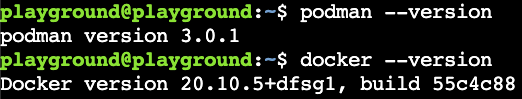
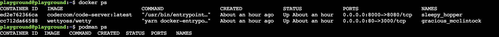
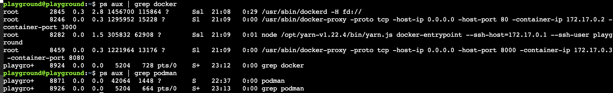
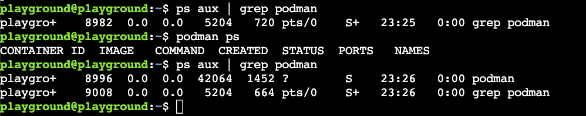
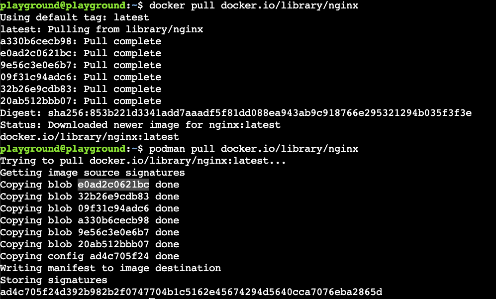
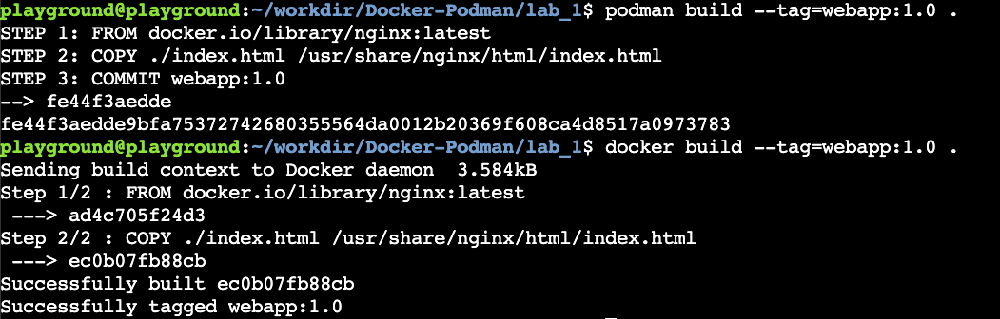

# Build and Run
## Starting point
On our instance we have Podman and Docker installed. For your convinience we also run [post-installation steps](https://docs.docker.com/engine/install/linux-postinstall) so you do not need to type `sudo` everytime. For those with trust issues - go ahead and execute:
```bash
docker --version
```
followed by 
```bash
podman --version
```
You should see:



For those who already know they way around and also executed `docker ps` and/or `podman ps` - commands which will show us running containers and noticed that we already have some containers running in docker. You should see the following output:


**Please do not stop those two Docker containers at any point of the lab. Wetty allows you to access the instance via web browser, while code-server is serving you the IDE.**
## Daemon vs Daemonless
Main difference between Docker and Podmam is the Daemon which is running only for Docker and acts as intermediary between Docker CLI and registries/containers/images and kernel. That process owns all child processes (i.e containers) and its failure will affects orphaned processes. It is also an additional attack surface and could lead to security vulnerabilities. Furthermore running daemon consume host resources, but do not take my words for it, lets see it ourseelves, by having a look on running processes.

Lets execute:
```bash
ps aux | grep docker
```
and
```bash
ps aux | grep podman
```
Your output should look like:


We can see in the example above that in case of docker our Daemon (PID 2845) maybe is not overloading our host it is consuming more resources than our two containers (PID's 8246, 8282, 8459).

Ok, there is no daemon for Podman, but something is running - what is it then? Once we execute Podman command it activates the API Socket for 5000s. If we will terminate the process by running
```bash
kill 8871 (pass the PID from the output)
```
it will be activated again once interacting with Podman API like in example below:


## Lets get some materials to build with :) 
Wether we will fall in love with Podman or Docker our journey usually starts with the base image. In most cases that will be a lightweight version of the OS we would like to build upon. We are not joking with the light here as for example Alpine linux weights a little as **5MB**! 

Today we will be working with an Nginx image, so lets get one by executing.
```bash
docker pull docker.io/library/nginx
```
and
```bash
podman pull docker.io/library/nginx
```
Your output should look like:


**Note:** The image we are using is build out of layers.
We can have a peak on each layer by executing:
```
docker history nginx
```
or
```
podman history nginx
```
Your output should look like below


**Note2:** For docker, you could also simply run `docker pull nginx` which would default to docker hub registry. Podman by default will ask you to specify the repository unless you will configure it differently by editing `/etc/containers/registries.conf`. Of course Docker hub is not the only container registry, you might end up using other public or private registry of your choice.

**Note3:** Images pulled by Docker will not be visible for Podman and images pulled by docker will not be visible for Docker as they are stored in the different directory on the host.

## Time to build
On your instance go to the directory with the llab repository. If you got lost - just execute:
```
cd $HOME/workdir/Docker-Podman/lab_1
```
You should find a `Dockerfile` and `index.html` there. We are going to build a container using Nginx as a base image. We will just add our astonishing website so we can run the container with our content.

Lets have a look on our `Dockerfile`. We can do it using provided IDE (${your}-panda.devopsplayground.org:8000). 

It should look like:
```Dockerfile
FROM docker.io/library/nginx:latest
COPY ./index.html /usr/share/nginx/html/index.html
```
It takes our base image and then copy our beatiful website to the container. This is very simple build and there is way more to play with if you want to dive deeper. ([Docs](https://docs.docker.com/engine/reference/builder/))

To build our image we need to execute:
```
podman build --tag=webapp:1.0 . 
```
and/or
```
docker build --tag=webapp:1.0 .
```
Your output should look like: 



**Note** 
Using `.` will instruct Docker/Podman to look for the Dockerfile in current directory. You can name file differently and/or specify different path using flag `--file`

**Note2**
You will see another layer now if you will run
```
docker history webapp:1.0
```
or
```
podman history webapp:1.0
```

## Lets see if it works!
We have our bespoke image ready! Time to see if all that effort was worth it! To run our newly baked containers we will need to execute the following:
```
docker run -itd -p 8081:80 --name webp webapp:1.0
```
and
```
podman run -itd -p 8080:80 --name webp webapp:1.0
```
**Note** While we can use the same port on the container as they do not know about each other, we need to bind them to a different port on the host.

Once you started the containers - have a look on what we created! 

For Docker we can execute:
```
curl localhost:8081
```
and for Podman
```
localhost:8080
```

If you want to see it at full glance - in your web browser go to `${your}-panda.devopspllayground.org:${port}`
## Well done!!!
Lab number one completed! You know how to build and run a container now and you understand the difference between Daemon and Daemonless design - time for lab number 2

[Rootless and Rootfull](../lab_2/README.md)