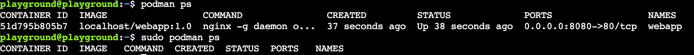
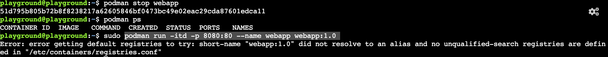
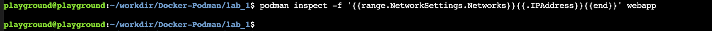
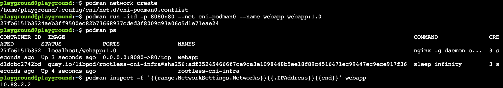
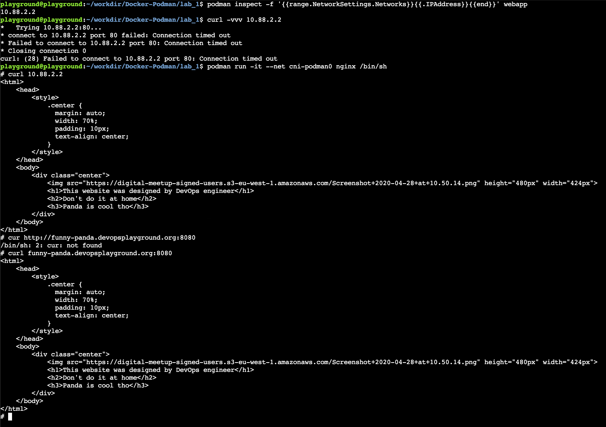
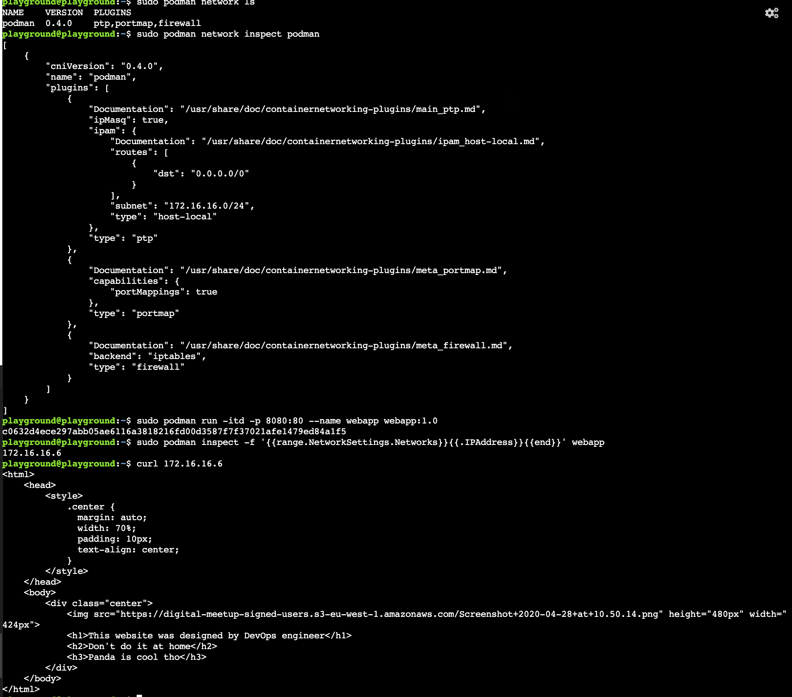
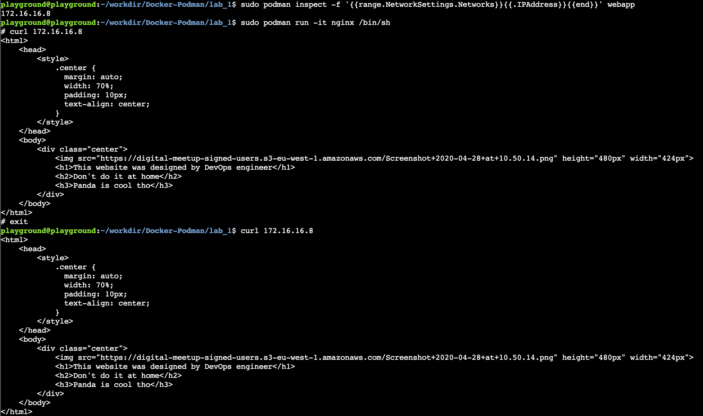
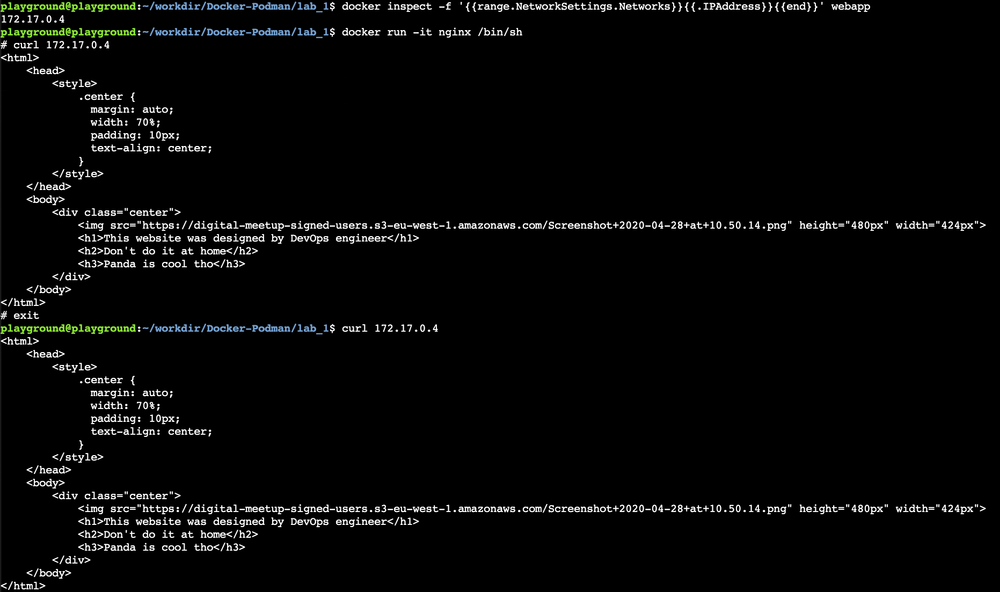

# Rootless and Rootful
## Intro
In this section we will go over the differences in running rootful and rootless containers. Podman's default behaviour is to run container in the rootless mode while Docker will run them as a root. Some of you probably already noticed it while we were looking on the processes in the previous lab.

**Note** Both Podman and Docker can run rootless and rootful containers. Docker added rootless mode as an experimental feature in v19.03 and it graduated in v20.10

## Podman rootful
Running podman containers as a root does not require much effort. All you need to do is to add `sudo` at the begging of your command. 
Go ahead and type:
```bash
podman ps
```
followed by:
```bash
sudo podman ps
```
You should see:

 
There is your familiar Nginx container once you are running command as a user, but while assuming root it is not there anymore.

Lets stop our rootless container to release the port and try to run it as a root. 

Lets execute:
```bash
podman stop webapp
podman ps
```
And then:
```bash
sudo podman run -itd -p 8080:80 --name webapp webapp:1.0
```
You should get an error message like below:



Root user despite all its power could not find our container. It is because the location where our images are stored on the host for non-root user and root user are different. Our playground user containers are saved in `$HOME/.local/share/containers/storage/` while for the root user the default directory is `/var/run/containers/storage`.

To run our container as a root we need to rebuild/move or push and pull from the remote registry.

In the next section we will be playing with rootless and rootful containers so lets rebuild it:
```bash
cd $HOME/workdir/Docker-Podman/lab_1
sudo podman build --tag=webapp:1.0 . 
```

**Note** While running containers in the rootless mode gives us separation of concerns it comes with some limitations ([docs](https://github.com/containers/podman/blob/main/rootless.md)).

## Podman networking (Rootless and Rootful)
### Rootless
Running rootless containers will affect their networking as non-privilliged users cannot create network interfaces on the host. Instead of CNI podman uses slirp4netns as defaullt network mode,but containers will not have routable ip address. 

Port mapping allows us to communicate between the host and container as seen in the previous lab. Lets start our web app container again and see it.
```bash
podman start webapp
curl localhost:8080
```
If we look closer on our container and execute:
```bash
podman inspect -f '{{range.NetworkSettings.Networks}}{{.IPAddress}}{{end}}' webapp
```
We will get an empty string as the IP address field for our container is empty (see below). 

Feel free to try
```bash
podman inspect webapp
```
to see the ful output of inspect command.
Podman since version 3.0 technically allows us to create CNI for rootles containers which will run as a side car. The IP assigned to the container nevertheless will not be routable from the host.

We can do it by executing the following steps
Remove existing webapp container:
```bash
podman rm -f webapp
```
Create network and run container attached to it.
```bash
podman network create
podman run -itd -p 8080:80 --net cni-podman0 --name webapp webapp:1.0
```
Verify
```bash
podman ps
podman inspect -f '{{range.NetworkSettings.Networks}}{{.IPAddress}}{{end}}' webapp
```

Your outputs should look like below



You can try to curl the IP from the output from the host, but it will time out

**Communication between rootless containers**
If we create a network for our rootless container while it is IP is not routable from the host we can reach it from another container.

We have our webapp running, lets start another container, but this time we will exec into our nginx server.

```bash
podman run -it --net cni-podman0 nginx /bin/sh
```
Once on the container lets try to curl the IP address of our web app
```bash
curl ${IP}
```
Another way to communicate between rootles containers is to leverage port mapping and reaching it using the host IP/DNS.

While still in nginx container try
```bash
curl ${your-panda}.devopsplayground.org:8080
```
There is one more way to communiacate between two rootless containers. We need to run both of them within the same pod. We will talk about the pods in the next lab.

If your typing skills are as bad as mine your outputs should look like:



### Rootful
When running containers as root they are attached to the CNI by default and we do not need to create it. The container IP will be routable from the host. 
We can verify that by following the steps below:

First lets see if the CNI is there:
```bash
sudo podman network ls
sudo podman network inspect podman
```
Then run our container and grab its IP
```bash
sudo podman run -itd -p 8080:80 --name webapp webapp:1.0
sudo podman inspect -f '{{range.NetworkSettings.Networks}}{{.IPAddress}}{{end}}' webapp
```
Finally lets try to curl its IP from the host
```bash
curl ${container IP}
```

Your outputs should look like below:



**Note:** You will see the same behaviour with your Docker container. CNI will be created, your container will be attached to it once started and routable IP will be assigned (see example below)

**Communication between rootful containers**
When running our containers in a rootful mode, our container IP is also routable from other containers. This is also a default behaviour for docker.

Podman:


Docker:




## Docker rootless

Docker rootless execution requires installation of additional package by the user (see [docs](https://docs.docker.com/engine/security/rootless/)). Once the package is installed we need to explicitly specify that we want run our containers in rootless mode. Once configuration is completed, we can observe the similar behaviour as seen with Podman. Networking is also handled by `slirp4netns` library and we can observe the similar drawbacks.

## Well done!!!
You completed lab number two. You should now know the difference between rootless and rootful containers as well as how each of the technologies approach those modes. In our last lab we will talk about podman pods.

**Next:** [Pods and Swarm](../lab_3/README.md)

Back to the [main page](../README.md)