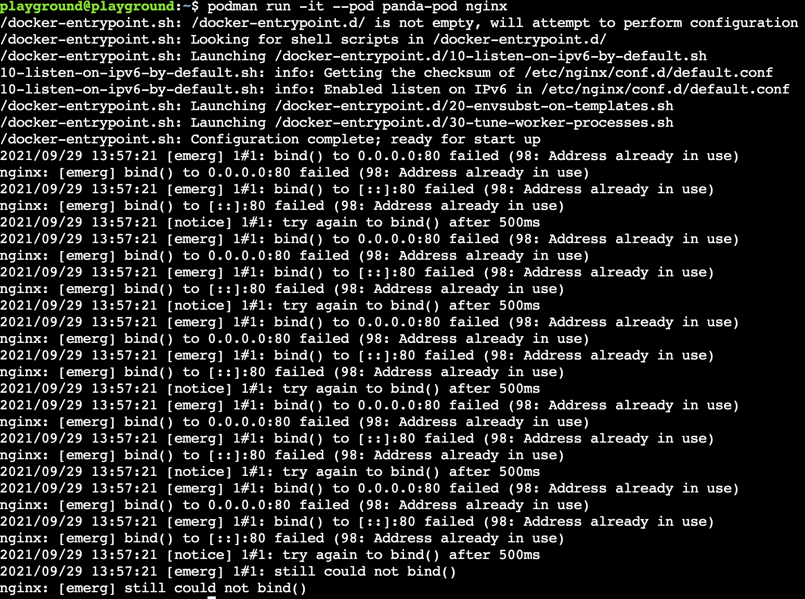
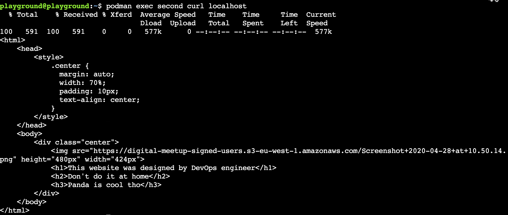
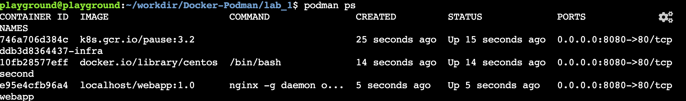

# Pods
## Intro
In this lab we will very briefly touch on Podmans unique funcionality. Podman support concept of pods which is very similar to what we can see in Kubernetes.
## Lets make some pods
To run our containers within the pod we need to create one.
We can do it with: 
```bash
podman pod create --publish 8080:80 --name panda-pod
```
and verify with 
```bash
podman pod ls
```
**Note** We mapped ports for our pod rather than container, we can specify port ranges as long os number of ports on the host is equal to number container ports. This cannot be modified once service is created.

We have our new pod - time to run some containers. We have our web app image ready so lets run it, but this time within our newly created pod:
```
podman run -itd --pod panda-pod --name webapp webapp:1.0
```
Note that we didn't publish the ports as we already did it for our pod. We can quickly execute:
```
curl localhost:8080
```
To confirm that our service is exposed.

## Communication between the containers within the Pod
Lets add another container to our pod to observe behaviour of our containers within the pod, we have that nginx image we can use, lets give it a try:
```
podman run -it --pod panda-pod nginx
```
You should get an error like below:



But why? We specified port mapping for the whole pod and we already have a container with port 80 exposed. Podman is trying to bind to our nginx too, but this mapping is already taken. 

Lets grab a different image without any exposed ports to run so we can have a look on what is happening inside our pod.

```
podman run -dit --pod panda-pod --name second docker.io/library/centos
```
Now lets execute curl command within our `second` container:

```
podman exec second curl localhost
```
Your output shoul look like below:



We didn't have to specify the port as we exposed port 80 (default) on the container and our second container reside within the same namespace.

**Note:** We can observe the same behaviour in rootful mode, but each container will also have its IP Address which could be resolved either from another container or the host.

**What is happening in the background?**

Lets execute:

```bash
podman ps
```
You should see 3 containers running. One of them is a side car which is handling the management of our pod.



We can take it a step further and generate a k8s manifest out of our pod.
```
podman generate kube panda-pod.yaml
```
This funcionality is still under development and might not work for all use cases, nevertheless still pretty cool!

## Well done!
That was the last lab for today, now you know what is podman pod and how containers communicate within the pod!

## Conclusion
Both technologies have pros and cons and while Docker definitely is way more mature (released in 2013) Podman has a lot to offer, especially considering that version 1.0.0 was released in 2019. There seem to be a lot of intereset and support fot the new player so definitely worth keeping an eye on the developments. I will let you decide who is your favourite and as usual strongly recommend to dig deeper and play around with more complex use cases. In my opinion `alias docker = podman` sounds a little optimistic and transitions usually expose some issues. It is not far off nevertheless which is impressive. [Here](https://github.com/containers/podman/blob/main/transfer.md) you can find the differences between commands.